<!-- Original graphics are stored in this repository. SVG animations respect reduced-motion preferences. -->

  

  
  &nbsp;
  

### A little about me

I'm **Nabin**, an IT student from Nepal working across **mobile development, UI design, and video editing**. I build with Flutter, shape stories in DaVinci Resolve, and enjoy bringing practical ideas to life through collaborative hackathons.

My contribution to **Saksi's national-level hackathon winning team** was UI design and overall team coordination. I care about how a product works, how it feels, and the details that connect the two.

### Selected work

  <a href="https://github.com/NepalTheHeaven/SOS_DISASTER_MANAGEMENT">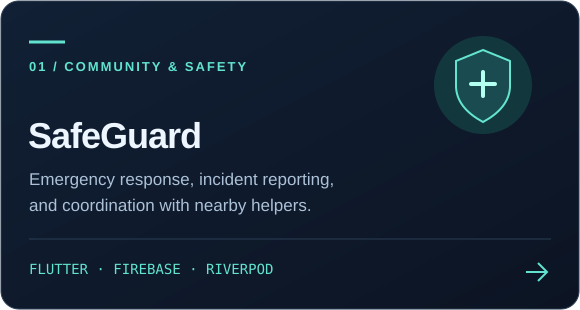</a>
  <a href="https://github.com/NepalTheHeaven/Portfolio">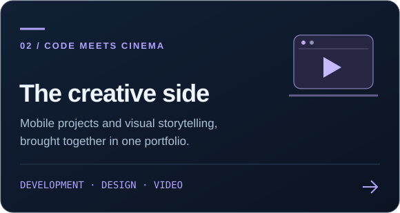</a>

  <a href="https://github.com/LumbiniX-Committee/Everest">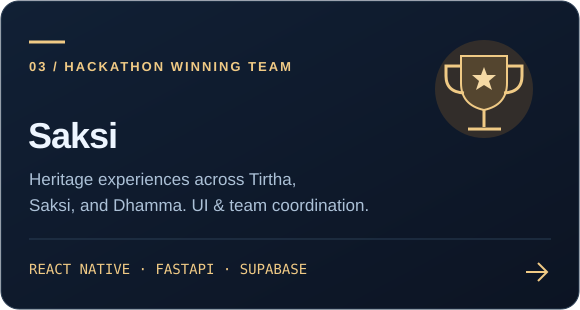</a>
  <a href="https://github.com/Codefest-chitwan-2026/Duvida">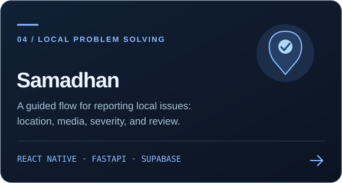</a>

Saksi and Samadhan cards open their respective project repositories. Illustrations are visual summaries, not app screenshots.

### My toolkit

  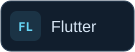
  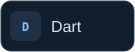
  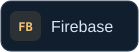
  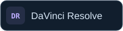

  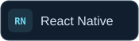
  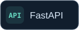
  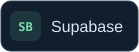

**Core focus:** Flutter and mobile UI implementation, video editing, colour grading, and sound design.  
**Project experience:** React Native, Firebase, FastAPI, and Supabase.

### My contribution trail

A little progress, one contribution at a time. The snake follows my GitHub contribution calendar and refreshes daily.

  

### From idea to experience

I enjoy the whole creative journey: understanding the problem, shaping the interface, building it, and refining the details.

  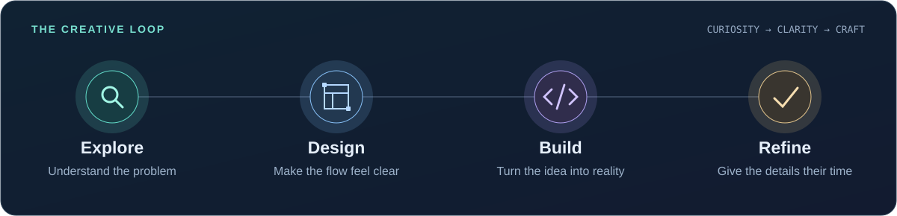

### Where code meets cinema

Whether I'm working on a mobile screen or a video timeline, I care about clarity, rhythm, and how the final experience feels.

  

 

